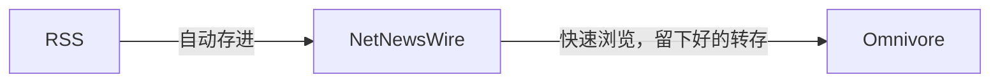

# 什么是 RSS？

> [!ai]+ AI
>
> RSS（简易信息聚合）是一种用于订阅网站内容更新的格式。用户可以使用 RSS 阅读器订阅自己感兴趣的网站，然后在一个地方查看所有更新内容，而无需逐个访问每个网站。通过 RSS，用户可以更轻松地跟踪他们关注的内容，并随时了解最新信息。

## 如何使用 RSS 阅读器订阅网站？

> [!ai]+ AI
>
> - 首先，选择一个适合你的RSS阅读器应用或网站。一些常见的RSS阅读器包括Feedly、Inoreader、NewsBlur等。
> - 打开你选择的RSS阅读器，通常会有一个“添加订阅”或类似的选项。
> - 复制你想订阅的网站的RSS订阅链接。这通常可以在网站上找到，一般会在页面底部或者使用搜索引擎搜索“[网站名称] RSS”来查找。
> - 在RSS阅读器中粘贴该链接，并确认添加订阅。
> - 现在你就可以在RSS阅读器中看到该网站最新的更新内容了。

# 开源免费的 RSS 阅读器

## 我目前用的软件解决方案：NetNewsWire 

关于这款 app 的优点，参考 [[2024-03-22_App+1 - 体验最接近「原生」，免费开源的老牌 RSS 阅读器：NetNewsWire - 少数派]]

可惜这款软件是基于 Swift 的，只支持苹果生态，且软件作者也没有后续其他平台的开发计划。可以参考以下这些：

> [!ai]+ AI
>
> 开源免费的 RSS 阅读器有很多，以下是一些常用的推荐：
> 1. **FeedReader**：FeedReader 是一个简单易用的开源 RSS 阅读器，支持订阅和管理多个 RSS 源。
> 2. **Tiny Tiny RSS**：Tiny Tiny RSS 是一个基于 Web 的开源 RSS 阅读器，可以在自己的服务器上搭建并使用。
> 3. **FreshRSS**：FreshRSS 是另一个基于 Web 的开源 RSS 阅读器，提供了类似 Google Reader 的界面和功能。
> 这些开源免费的 RSS 阅读器都提供了不错的功能和用户体验，可以根据个人喜好选择适合自己的使用。

## 我目前的 RSS 流程 

# 通过 RSS 阅读器订阅 Newsletter 

参考这篇文章 👉 [[Newsletter to rss]]

